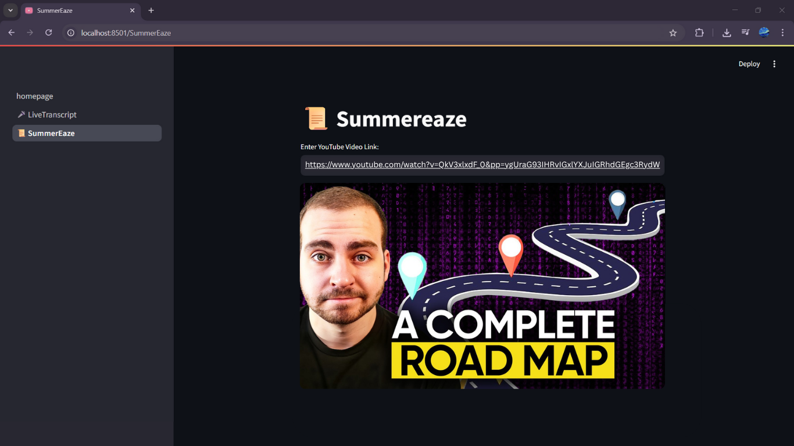
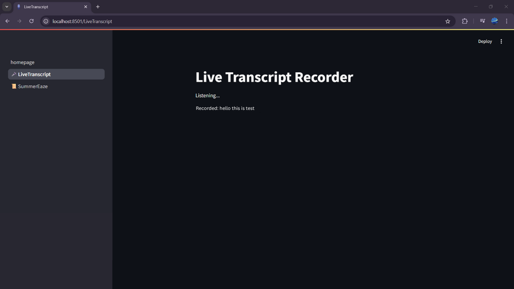

# SummerEaze

SummarEaze is a project designed to simplify learning through YouTube videos. It offers comprehensive summaries for any YouTube video, streamlining the study process and saving time for users.
It has two versions currently, one of which is made using streamlit and another made using flask.
A web extension is also coming soon.

